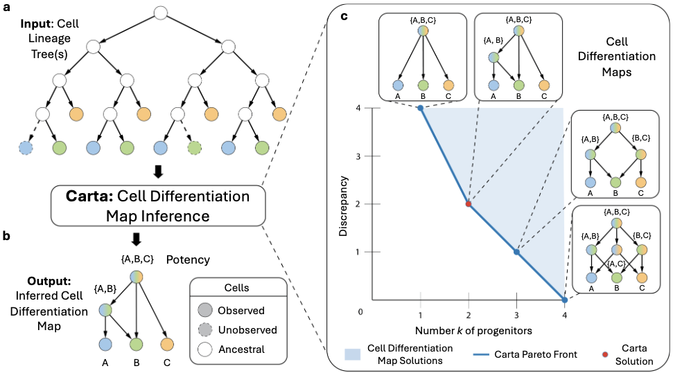

# CARTA (cell differentiation map inference)


<!--Overview of the CARTA algorithm.-->
**Cell differentiation mapping from lineage tracing data using Carta.** (a) The input to Carta is one or more cell lineage trees, whose leaves are labeled by the measured cell type (labeled A, B, C) of the sequenced cells. Typically, some cells that are present at the time of the experiment are not sampled (denoted by dotted lines). (b) Carta infers a cell differentiation map that describes the progenitor cell types – represented as a potency set – and cell type transitions that occurred during development. (c) Carta quantifies the trade-off between the number k of progenitor cell types in the cell differentiation map and its discrepancy with the cell lineage trees by computing the Pareto front of optimal solutions. A cell differentiation map with the optimal number k* of progenitors is chosen by identifying an elbow of the Pareto front.

## Contents

  1. [Pre-requisites](#pre-requisites)
  2. [Installation](#installation)
     * [Recommended](#local)
     * [Alternative](#global)
  4. [Usage instructions](#usage)
     * [Input file format](#input)
     * [Arguments](#arguments)
     * [Output file format](#output)
     * [Example](#example)
  5. [Data](#data)

<a name="pre-requisites"></a>
## Pre-requisites
+ [numpy](https://numpy.org/doc/)
+ [pandas](https://pandas.pydata.org/pandas-docs/stable/index.html)
+ [gurobipy](https://www.gurobi.com/documentation/9.0/quickstart_mac/py_python_interface.html)
+ [networkx](https://networkx.org/)
+ [cassiopeia](https://github.com/YosefLab/Cassiopeia)
+ [ete3](https://pypi.org/project/ete3/)
+ (for generating simulation and real data instances) [snakemake (>=5.2.0)](https://snakemake.readthedocs.io)

<a name="installation"></a>
## Installation

<a name="local"></a>
### Recommended

1. Create a new conda environment named "carta" and install dependencies:

   ```bash
   conda create -n carta python==3.10.13 pip
   ```

2. Then activate the created environment:
   ```bash
   conda activate carta
   ```

4. Clone the git repository

    ```bash
    git clone git@github.com:raphael-group/CARTA.git
    ```

5. Use `pip` to install the package:
    ```bash
    cd carta
    pip install .
    ```

<a name="global"></a>
### Alternative
1. Create a new conda environment named "carta" and install dependencies:

   ```bash
   conda create -n carta python==3.10.13 pip
   ```

2. Then activate the created environment:
   ```bash
   conda activate carta
   ```

4. Install carta-cell from pip:

    ```bash
    pip install carta-cell==1.0
    ```

5. Install cassiopeia:
    ```bash
    pip install git+https://github.com/YosefLab/Cassiopeia@master#egg=cassiopeia-lineage
    ```

<a name="usage"></a>
## Usage instructions

<a name="input"></a>
### Input file format
The input for CARTA is 
- A tab-delimited file, which has on each line the locations of the newick and state annotation files of the set of cell lineage trees over which to infer the cell differentiation map.
    - Example for location file `test/test_locations.txt`
    - Example for newick file `test/concat_TLS.nwk`
    - Example for state annotation file `test/concat_TLS_meta_reduced.txt`
- A file containing all terminal cell types must be provided, with each cell type on its own line.
    - Example for states file: `test/TLS_states.txt`
- [Optional] A file with list of putative progenitors in csv format encoding a binary matrix, where each row is progenitor and column is a cell type.
    - Example for putative progenitors file: `test/progen_mat.csv`

<a name="arguments"></a>
### Arguments

    usage: carta [-h] [--prefix PREFIX] [-ks [KLIST ...]] [--file_locations FILE_LOCATIONS] [--states_file STATES_FILE]
             [--normalize_method {no_normalization,cell_proportion_before_pruning,cell_proportion_after_pruning}]
             [--time_limit_sec TIME_LIMIT_SEC] [--enforce_tree] [-m {exact,round}] [--progen_matrix PROGEN_MATRIX]

    options:
      -h, --help            show this help message and exit
      --prefix PREFIX       filepath prefix for this run
      -ks [KLIST ...], --klist [KLIST ...]
                            list of number of progenitors
      --file_locations FILE_LOCATIONS
                            a file that on each line specifies the filepath of a newick file and a corresponding state metadata file in
                            that order, seperated by a tab
      --states_file STATES_FILE
                            a file containing the cell states present in this dataset
      --normalize_method {no_normalization,cell_proportion_before_pruning,cell_proportion_after_pruning}
                            the scheme by which to normalize the objective function
      --time_limit_sec TIME_LIMIT_SEC
                            time limit on ilp runs
      --enforce_tree        whether or not to enforce that the progenitors can create a tree
      -m {exact,round}, --mode {exact,round}
                            mode for heuristic progenitor set solver
      --progen_matrix PROGEN_MATRIX

<a name="output"></a>
### Output
- Without putative progenitors
    - Progenitors file: provides the set of selected progenitors in the cell differentiation map. Each line is a progenitor.
       - Example: `test/test_Carta_progenitors_3.txt`
    - Node labeling file: tab-separated file where each row descrbeis the progenitor labeling of a node in a cell linage tree.
       - Example: `test/test_Carta_nodeLabels_3.txt`
- With putative progenitors
    - Progenitors file: provides the set of selected progenitors in the cell differentiation map. Each line is a progenitor.
       - Example: `test/test_fastCarta_progenitors_3.txt`
    - Edge labeling file: tab-separated file where each row describes the progenitor labeling of source and target node of an each in a cell lineage tree.
       - Example: `test/test_fastCarta_edge_labeling_3.txt`
<a name="example"></a>
### Example

An example of usage is as follows. This command can be run from the directory that contains this README file.

    carta --file_locations test/test_locations.txt --states_file test/TLS_states.txt --klist 1 2 3 --prefix test/test_Carta

An example while providing a set of putative progenitors as input.

    carta --file_locations test/test_locations.txt --states_file test/TLS_states.txt --klist 1 2 3 --prefix test/test_fastCarta --progen_matrix test/progen_mat.csv

<a name="data"></a>
## Data
The newick files for the TLS cell lineage trees are stored in `data/TLS/input_trees` and the metadata files containing the cell type annotations are stored in `data/TLS/formatted_and_reduced_labels`.

The input files for mouse hematopoiesis data are stored in `data/larry/input`. The format of this data is slightly different and we use the code `scripts/larry.py` which implements the CARTA-tree ILP that can take the mouse hematopoiesis data as input. The raw mouse hematopoiesis data is availabe at `https://github.com/AllonKleinLab/paper-data/tree/master/Lineage_tracing_on_transcriptional_landscapes_links_state_to_fate_during_differentiation`

The Snakefiles to generate the simulations and run cell differentiation mapping methods (including Carta) are provided in `data/simulations`.
